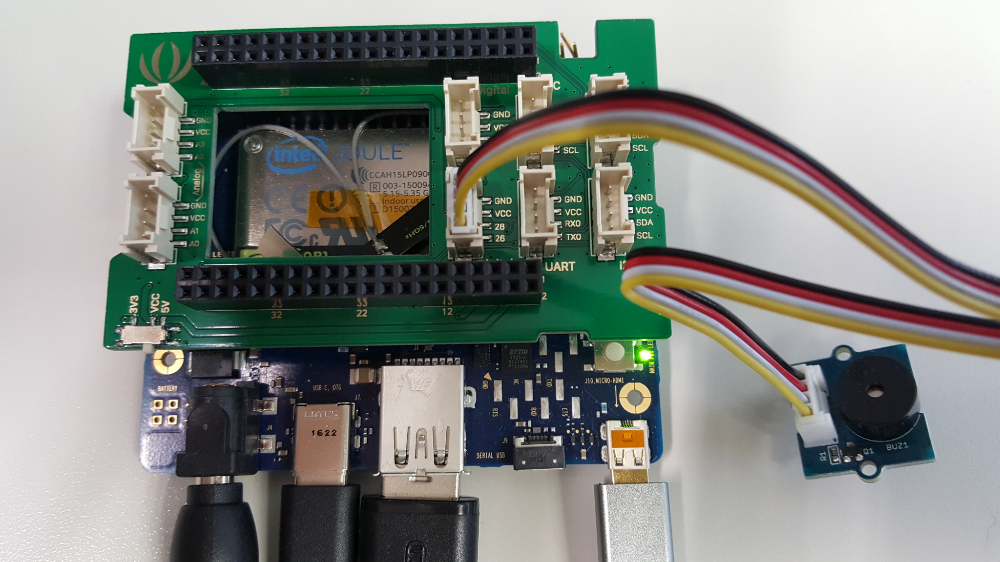

<!--
# license: Licensed to the Apache Software Foundation (ASF) under one
#         or more contributor license agreements.  See the NOTICE file
#         distributed with this work for additional information
#         regarding copyright ownership.  The ASF licenses this file
#         to you under the Apache License, Version 2.0 (the
#         "License"); you may not use this file except in compliance
#         with the License.  You may obtain a copy of the License at
#
#           http://www.apache.org/licenses/LICENSE-2.0
#
#         Unless required by applicable law or agreed to in writing,
#         software distributed under the License is distributed on an
#         "AS IS" BASIS, WITHOUT WARRANTIES OR CONDITIONS OF ANY
#         KIND, either express or implied.  See the License for the
#         specific language governing permissions and limitations
#         under the License.
-->

# cordova-plugin-vibration

This plugin aligns with the W3C vibration specification http://www.w3.org/TR/vibration/

This plugin provides a way to vibrate the device on Android Things.

This plugin defines global objects including `navigator.vibrate`.

Although in the global scope, they are not available until after the `deviceready` event.

    document.addEventListener("deviceready", onDeviceReady, false);
    function onDeviceReady() {
        console.log(navigator.vibrate);
    }

## Pre-requisites

- Joule device
- Following individual components:
    - 1 [Grove Buzzer](https://www.seeedstudio.com/Grove-Buzzer-p-768.html)
    - jumper wires
    - Ground pin to breakout J13 1 pin, Vcc to breakout j13 2 pin, SIG to breakout j12 26 pin with [PWM_0](http://www.intel.com/content/www/us/en/support/boards-and-kits/intel-joule-kits/000022494.html).
    - Schematics for Intel Joule
    

## Installation

    cordova plugin add https://github.com/fujunwei/cordova-plugin-vibration.git

## Supported Platforms

- Android Things

## Sample Testing

    cordova create vibrationTesting org.example.vibrationTesting vibrationTesting --template https://github.com/fujunwei/cordova-template-reference.git#vibration_testing
    cd vibrationTesting
    cordova platform add android
    cordova plugin add https://github.com/fujunwei/cordova-plugin-vibration.git#android_things
    cordova run

## Song Patterns
[Groggie](http://www.reddit.com/user/Groggie) mentioned his [blog post](http://gearside.com/cool-vibration-patterns-for-mobile-devices/%20Custom%20vibration%20patterns%20for%20mobile%20devices) on using the Vibration API for music and theme songs. It's a really cool example of what can be done using the Vibration API and some creative thought. Click on the titles below to play.

- Super Mario Theme Intro
    navigator.vibrate([125,75,125,275,200,275,125,75,125,275,200,600,200,600]);
- James Bond 007
    navigator.vibrate([200,100,200,275,425,100,200,100,200,275,425,100,75,25,75,125,75,25,75,125,100,100]);

## vibrate

Vibrates the device for a given amount of time.

    navigator.vibrate(time)

-__time__: Milliseconds to vibrate the device. _(Number)_

